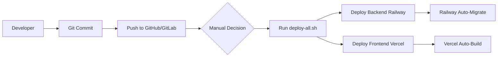
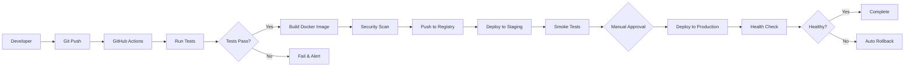

# DevOps Infrastructure Analysis & Recommendations
## IntoWork Dashboard - Comprehensive Review

**Report Date:** 2026-01-06
**Analyst:** Senior DevOps Engineer
**Project:** IntoWork Dashboard (B2B2C Recruitment Platform)

---

## Executive Summary

The IntoWork Dashboard demonstrates **good foundational DevOps practices** with solid deployment automation, dual-repository redundancy, and containerization. However, there are **critical gaps in production-readiness**, particularly in monitoring, disaster recovery, security hardening, and infrastructure as code maturity.

### Overall DevOps Maturity Score: 6.5/10

| Category | Score | Status |
|----------|-------|--------|
| Deployment Automation | 8/10 | Good |
| Infrastructure as Code | 5/10 | Needs Improvement |
| CI/CD Pipeline | 6/10 | Basic |
| Monitoring & Observability | 3/10 | Critical Gap |
| Security & Secrets Management | 7/10 | Good |
| Disaster Recovery & Backups | 4/10 | Needs Improvement |
| Documentation | 8/10 | Good |

---

## 1. Infrastructure Overview

### Current Architecture

**Stack:**
- **Backend:** FastAPI on Railway (Dockerfile-based deployment)
- **Frontend:** Next.js 16 on Vercel
- **Database:** PostgreSQL 15 (Railway managed)
- **Deployment:** Manual via CLI scripts (Railway CLI, Vercel CLI)
- **Version Control:** Dual-repo (GitHub + GitLab) with automated sync

**Deployment Flow:**
```
Developer → Local Dev → Git Push (GitHub/GitLab) → Manual CLI Deploy → Production
                                  ↓
                          GitHub Actions Sync
```

### Infrastructure Files Analyzed

1. **Docker Configuration:**
   - `/Dockerfile` - Multi-stage backend build (Python 3.11-slim)
   - `/Dockerfile.frontend` - Multi-stage Next.js build (Node 20-alpine)
   - `/backend/docker-compose.yml` - Local development PostgreSQL

2. **Deployment Configuration:**
   - `/railway.toml` - Railway deployment settings
   - `/railway.env.example` - Environment variable template
   - `/frontend/vercel.json` - Vercel build configuration
   - `/backend/start.sh` - Railway startup script with migrations

3. **Automation Scripts:**
   - `/scripts/deploy-all.sh` - Combined deployment orchestration
   - `/scripts/deploy-railway.sh` - Backend deployment automation
   - `/scripts/deploy-vercel.sh` - Frontend deployment automation
   - `/scripts/generate-secrets.sh` - Secret generation utility
   - `/scripts/push-all.sh` - Dual-repo push automation

4. **CI/CD:**
   - `/.github/workflows/sync-repositories.yml` - GitHub → GitLab sync
   - `/.gitlab-ci.yml` - GitLab → GitHub sync

5. **Development Utilities:**
   - `/start-dev.sh` - Local development orchestration
   - `/Makefile` - Development command shortcuts

---

## 2. Strengths & Positive Findings

### 2.1 Deployment Automation (8/10)

**Strengths:**
- Comprehensive deployment scripts with interactive prompts
- Multi-stage Docker builds for optimized image sizes
- Automated database migrations via Alembic in startup script
- Non-root user execution in containers (security best practice)
- Health check endpoints configured (`/health`, `/api/ping`)

**Evidence:**
```dockerfile
# Dockerfile - Multi-stage build with security
FROM python:3.11-slim AS base
...
RUN useradd -m -u 1000 appuser
USER appuser

HEALTHCHECK --interval=30s --timeout=10s --start-period=40s --retries=3
```

```bash
# backend/start.sh - Automated migrations
python -m alembic upgrade head
exec uvicorn app.main:app --host 0.0.0.0 --port ${PORT:-8000}
```

### 2.2 Security Configuration (7/10)

**Strengths:**
- Security headers middleware implemented (X-Frame-Options, X-Content-Type-Options, HSTS)
- Rate limiting with SlowAPI (DDoS protection)
- JWT authentication with NextAuth v5 (migrated from Clerk, saving $300k-600k/year)
- Bcrypt password hashing
- CORS properly configured with specific origins
- Secrets generation script with secure random values
- `.env` files properly gitignored

**Evidence:**
```python
# backend/app/main.py - Security headers
class SecurityHeadersMiddleware(BaseHTTPMiddleware):
    async def dispatch(self, request: Request, call_next):
        response = await call_next(request)
        response.headers["X-Content-Type-Options"] = "nosniff"
        response.headers["X-Frame-Options"] = "DENY"
        response.headers["Strict-Transport-Security"] = "max-age=31536000"
        # ...
```

```bash
# scripts/generate-secrets.sh
NEXTAUTH_SECRET=$(openssl rand -base64 32)
JWT_SECRET=$(openssl rand -base64 32)
```

### 2.3 Dual-Repository Redundancy (9/10)

**Strengths:**
- Excellent redundancy with GitHub + GitLab
- Automated bidirectional sync via GitHub Actions and GitLab CI
- Scripts for manual sync (push-all.sh, commit-and-push-all.sh)
- Makefile integration (`make push`, `make sync`)
- Graceful degradation if tokens not configured

**Evidence:**
```yaml
# .github/workflows/sync-repositories.yml
- git push gitlab ${GITHUB_REF#refs/heads/} --force-with-lease
```

### 2.4 Documentation (8/10)

**Strengths:**
- Comprehensive CLAUDE.md with architecture details
- Extensive deployment guides in `/docs/deployment/`
- Environment variable templates with detailed comments
- Monitoring setup guide (`MONITORING_SETUP_GUIDE.md`)
- README files for GitHub/GitLab workflows

---

## 3. Critical Gaps & Vulnerabilities

### 3.1 Monitoring & Observability (3/10) - CRITICAL

**Issues:**
- **No production monitoring implemented** (Sentry, Datadog, etc.)
- **No centralized logging** beyond Railway default logs
- **No application performance monitoring (APM)**
- **No alerting system** for errors or downtime
- **No metrics collection** (Prometheus, CloudWatch)
- **No distributed tracing** for debugging

**Impact:**
- Cannot detect production issues proactively
- Debugging failures requires manual log diving
- No visibility into user impact during incidents
- Mean Time To Detection (MTTD) is extremely high

**Recommendation:**
```bash
# IMMEDIATE ACTION: Implement Sentry (Free Tier)
# backend/requirements.txt
sentry-sdk[fastapi]==1.40.0

# backend/app/main.py
import sentry_sdk
sentry_sdk.init(
    dsn=os.getenv("SENTRY_DSN"),
    environment=os.getenv("ENVIRONMENT", "development"),
    traces_sample_rate=0.1,  # 10% performance monitoring
)
```

**Priority:** CRITICAL - Implement within 1 week

### 3.2 Disaster Recovery & Backups (4/10) - HIGH PRIORITY

**Issues:**
- **No automated database backups**
- **No backup restoration testing**
- **No disaster recovery plan**
- **No point-in-time recovery (PITR)**
- Manual backups found (`backup_20260105_*.sql`) but no automation

**Impact:**
- Data loss risk in case of database corruption
- No recovery time objective (RTO) or recovery point objective (RPO)
- Unverified backup integrity

**Recommendation:**
```bash
# Create automated backup script
# scripts/backup-database.sh
#!/bin/bash
TIMESTAMP=$(date +%Y%m%d_%H%M%S)
BACKUP_FILE="backups/db_${TIMESTAMP}.sql"
railway run pg_dump ${DATABASE_URL} > ${BACKUP_FILE}
gzip ${BACKUP_FILE}

# Upload to S3/R2 for offsite storage
aws s3 cp ${BACKUP_FILE}.gz s3://intowork-backups/

# Retention: keep 7 daily, 4 weekly, 12 monthly
```

**Priority:** HIGH - Implement within 2 weeks

### 3.3 CI/CD Pipeline Maturity (6/10) - MEDIUM

**Issues:**
- **No automated testing in CI/CD** (tests exist but not in pipeline)
- **No automated quality gates** (linting, type checking)
- **No automated security scanning** (dependency vulnerabilities)
- **No deployment previews for PRs**
- Manual deployment via CLI scripts (not GitOps)

**Impact:**
- Bugs can reach production without automated detection
- Security vulnerabilities may go unnoticed
- Deployment process requires manual intervention

**Recommendation:**
```yaml
# .github/workflows/ci.yml
name: Continuous Integration

on: [push, pull_request]

jobs:
  backend-tests:
    runs-on: ubuntu-latest
    steps:
      - uses: actions/checkout@v4
      - name: Run backend tests
        run: |
          cd backend
          pip install -r requirements.txt
          pytest tests/ --cov=app --cov-report=xml

      - name: Security scan
        run: |
          pip install safety bandit
          safety check
          bandit -r app/

  frontend-tests:
    runs-on: ubuntu-latest
    steps:
      - uses: actions/checkout@v4
      - name: Run frontend tests
        run: |
          cd frontend
          npm ci
          npm run lint
          npm run type-check
          npm test
```

**Priority:** MEDIUM - Implement within 1 month

### 3.4 Infrastructure as Code Gaps (5/10) - MEDIUM

**Issues:**
- **Railway configuration not fully as code** (relies on UI/CLI)
- **No Terraform/Pulumi for infrastructure provisioning**
- **Database schema in migrations only** (no declarative schema-as-code)
- **Environment parity challenges** (dev uses docker-compose, prod uses Railway)

**Impact:**
- Infrastructure drift between environments
- Difficult to reproduce production environment
- Manual setup required for new environments

**Recommendation:**
```hcl
# infrastructure/terraform/main.tf
terraform {
  required_providers {
    railway = {
      source = "terraform-community-providers/railway"
    }
  }
}

resource "railway_service" "backend" {
  name = "intowork-backend"
  environment_variables = {
    DATABASE_URL     = railway_postgres.db.connection_string
    NEXTAUTH_SECRET  = var.nextauth_secret
  }
}

resource "railway_postgres" "db" {
  name = "intowork-db"
}
```

**Priority:** MEDIUM - Implement within 2 months

### 3.5 Docker Optimization Issues (6/10)

**Issues:**
- **Frontend Dockerfile missing standalone output** in actual build
- **No multi-architecture builds** (arm64 for Apple Silicon developers)
- **Backend Dockerfile installs gcc** (increases attack surface)
- **No image scanning** for vulnerabilities
- **No image size optimization metrics**

**Current vs. Optimized:**
```dockerfile
# Current: Dockerfile.frontend missing Next.js standalone
COPY --from=builder /app/.next/standalone ./

# Issue: next.config.js has output: 'standalone' but build may fail
# Fix: Ensure next.config.js is consistent and test standalone builds
```

**Recommendation:**
```bash
# Add to CI/CD
docker scout cves intowork-backend:latest
trivy image intowork-backend:latest
```

**Priority:** LOW - Implement within 3 months

### 3.6 Environment Configuration Issues (7/10)

**Issues:**
- **No environment-specific configurations** (dev/staging/prod)
- **Hardcoded CORS origins** in main.py (should be env variables)
- **No secret rotation policy**
- **Railway environment variables managed via CLI** (not declarative)

**Recommendation:**
```python
# backend/app/config.py
from pydantic_settings import BaseSettings

class Settings(BaseSettings):
    environment: str = "development"
    database_url: str
    nextauth_secret: str
    cors_origins: list[str] = ["http://localhost:3000"]
    sentry_dsn: str | None = None

    class Config:
        env_file = ".env"

settings = Settings()
```

**Priority:** MEDIUM - Implement within 1 month

---

## 4. Security Concerns

### 4.1 Current Security Posture

**Strengths:**
- Security headers middleware
- Rate limiting
- JWT authentication
- Non-root containers
- Secrets properly gitignored

**Vulnerabilities:**

1. **Missing Dependency Scanning:**
   ```bash
   # No automated vulnerability scanning
   # Recommendation: Add to CI/CD
   pip install safety
   safety check --json
   ```

2. **No Web Application Firewall (WAF):**
   - Recommendation: Use Cloudflare free tier for DDoS protection

3. **No Container Image Scanning:**
   ```bash
   # Add to build process
   trivy image intowork-backend:latest --severity HIGH,CRITICAL
   ```

4. **Hardcoded Secrets in Examples:**
   - `railway.env.example` has placeholder values (good)
   - But no validation that actual secrets are rotated from defaults

5. **CORS Wildcard Pattern:**
   ```python
   # Potentially too permissive
   "https://*.vercel.app"  # All Vercel deployments
   # Recommendation: Specific subdomain validation
   ```

**Priority Fixes:**
- Dependency scanning: HIGH (1 week)
- Image scanning: MEDIUM (2 weeks)
- WAF setup: MEDIUM (1 month)

---

## 5. Deployment Process Analysis

### 5.1 Current Deployment Workflow



**Strengths:**
- Script-based automation reduces human error
- Interactive prompts for safety
- Automated migrations on Railway startup
- Health checks configured

**Weaknesses:**
- Manual trigger (no continuous deployment)
- No rollback automation
- No deployment verification tests
- No staged rollout (blue-green, canary)

### 5.2 Recommended GitOps Workflow



**Implementation Steps:**
1. Move to GitHub Actions for automated deploys
2. Add automated testing gates
3. Implement deployment verification
4. Set up staging environment
5. Add rollback automation

**Timeline:** 6-8 weeks

---

## 6. Infrastructure as Code Recommendations

### 6.1 Current State

**What's Codified:**
- Docker images (Dockerfile, Dockerfile.frontend)
- Database schema (Alembic migrations)
- Application configuration (environment variables)

**What's NOT Codified:**
- Railway service configuration
- Vercel project configuration
- Database instance provisioning
- Networking/routing rules
- Monitoring dashboards

### 6.2 Recommended IaC Stack

**Option A: Terraform (Recommended)**
```hcl
# infrastructure/main.tf
module "backend" {
  source = "./modules/railway-service"

  name     = "intowork-backend"
  docker_image = "intowork-backend:${var.version}"

  environment = {
    DATABASE_URL    = module.database.connection_string
    NEXTAUTH_SECRET = data.vault_generic_secret.auth.data["nextauth_secret"]
  }

  health_check = {
    path     = "/health"
    interval = 30
  }
}

module "database" {
  source = "./modules/railway-postgres"

  name           = "intowork-db"
  size           = "shared"
  backup_enabled = true
  backup_schedule = "0 2 * * *"  # Daily at 2 AM
}
```

**Option B: Pulumi (Developer-Friendly)**
```python
# infrastructure/__main__.py
import pulumi
import pulumi_railway as railway

backend = railway.Service("intowork-backend",
    name="intowork-backend",
    dockerfile="./Dockerfile",
    environment_variables={
        "DATABASE_URL": db.connection_string,
        "NEXTAUTH_SECRET": config.require_secret("nextauth_secret"),
    },
    health_check=railway.HealthCheckArgs(
        path="/health",
        interval=30,
    )
)
```

**Recommendation:** Start with Terraform for wider ecosystem support

**Timeline:** 8-12 weeks for full migration

---

## 7. Monitoring & Observability Strategy

### 7.1 Proposed Monitoring Stack (Free Tier)

| Layer | Tool | Cost | Implementation Time |
|-------|------|------|---------------------|
| **Error Tracking** | Sentry | Free (5k events/month) | 2 hours |
| **Uptime Monitoring** | UptimeRobot | Free (50 monitors) | 1 hour |
| **Log Aggregation** | Railway Logs | Included | 0 hours (already have) |
| **APM** | Railway Metrics | Included | 0 hours (already have) |
| **Status Page** | Statuspage.io | Free tier | 3 hours |
| **Real User Monitoring** | Vercel Analytics | Included | 1 hour |

**Total Cost:** $0/month
**Total Implementation Time:** ~7 hours

### 7.2 Implementation Phases

**Phase 1: Error Tracking (Week 1)**
```python
# backend/app/main.py
import sentry_sdk
from sentry_sdk.integrations.fastapi import FastApiIntegration

sentry_sdk.init(
    dsn=os.getenv("SENTRY_DSN"),
    environment=os.getenv("ENVIRONMENT", "development"),
    integrations=[FastApiIntegration()],
    traces_sample_rate=0.1,
    profiles_sample_rate=0.1,
)
```

**Phase 2: Uptime Monitoring (Week 1)**
- Configure UptimeRobot monitors:
  - Backend health: `https://backend.railway.app/health`
  - Frontend: `https://intowork.vercel.app`
  - API: `https://backend.railway.app/api/ping`
- Set up email/Slack alerts

**Phase 3: Structured Logging (Week 2)**
```python
# backend/app/utils/logging.py
import structlog

logger = structlog.get_logger()

# Usage
logger.info("user_login", user_id=user.id, ip=request.client.host)
```

**Phase 4: Metrics & Dashboards (Week 3-4)**
- Railway built-in metrics (already available)
- Custom business metrics:
  - Job applications per day
  - User signups per hour
  - API response times by endpoint

### 7.3 Alerting Strategy

**Alert Tiers:**

| Severity | Response Time | Notification |
|----------|---------------|--------------|
| **P1 - Critical** | Immediate | PagerDuty, Phone, Slack |
| **P2 - High** | 30 minutes | Slack, Email |
| **P3 - Medium** | 4 hours | Email |
| **P4 - Low** | Next business day | Email digest |

**Sample Alerts:**

1. **P1 - Service Down**
   - Trigger: Health check fails for 2 consecutive checks
   - Response: Auto-rollback if deployment < 1 hour old

2. **P2 - High Error Rate**
   - Trigger: >5% error rate over 5 minutes
   - Response: Investigate immediately

3. **P3 - Slow Response Times**
   - Trigger: p95 latency > 2 seconds
   - Response: Review and optimize

4. **P4 - Disk Space**
   - Trigger: >80% disk usage
   - Response: Review file uploads, clean old files

---

## 8. Disaster Recovery Plan

### 8.1 Current Recovery Capabilities

**Recovery Time Objective (RTO):** Unknown (likely 4-24 hours)
**Recovery Point Objective (RPO):** Unknown (could lose days of data)

**Critical Gap:** No tested disaster recovery plan

### 8.2 Recommended DR Strategy

**Backup Strategy:**

```bash
#!/bin/bash
# scripts/backup-automated.sh
# Run daily via GitHub Actions or Railway cron

TIMESTAMP=$(date +%Y%m%d_%H%M%S)
RETENTION_DAYS=30

# 1. Database backup
railway run pg_dump $DATABASE_URL | gzip > backups/db_${TIMESTAMP}.sql.gz

# 2. Upload to multiple locations (3-2-1 rule)
# - 3 copies
# - 2 different media
# - 1 offsite
aws s3 cp backups/db_${TIMESTAMP}.sql.gz s3://intowork-backups-primary/
rclone copy backups/db_${TIMESTAMP}.sql.gz cloudflare-r2:intowork-backups/

# 3. Verify backup integrity
gunzip -t backups/db_${TIMESTAMP}.sql.gz

# 4. Cleanup old backups
find backups/ -name "db_*.sql.gz" -mtime +${RETENTION_DAYS} -delete

# 5. Alert on failure
if [ $? -ne 0 ]; then
    curl -X POST $SLACK_WEBHOOK -d '{"text":"Backup failed!"}'
fi
```

**Restoration Testing:**
```bash
# scripts/test-restore.sh
# Run monthly to verify backup integrity

# 1. Create test database
railway run createdb intowork_restore_test

# 2. Restore latest backup
gunzip -c backups/db_latest.sql.gz | railway run psql intowork_restore_test

# 3. Run validation queries
railway run psql intowork_restore_test -c "SELECT COUNT(*) FROM users;"

# 4. Cleanup
railway run dropdb intowork_restore_test
```

**DR Runbook:**

1. **Scenario: Complete Database Loss**
   - RTO Target: 4 hours
   - RPO Target: 24 hours (daily backups)
   - Steps:
     1. Provision new Railway PostgreSQL instance
     2. Restore latest backup from S3
     3. Update DATABASE_URL in Railway
     4. Restart backend service
     5. Verify application functionality
     6. Run data integrity checks

2. **Scenario: Railway Outage**
   - RTO Target: 2 hours
   - Steps:
     1. Deploy backend to backup provider (Fly.io, Render)
     2. Update Vercel API_URL
     3. Redirect DNS if necessary
     4. Monitor logs and errors

3. **Scenario: Vercel Outage**
   - RTO Target: 1 hour
   - Steps:
     1. Deploy frontend to Netlify (pre-configured)
     2. Update DNS CNAME
     3. Verify API connectivity

**Implementation Timeline:**
- Week 1: Automated backup script
- Week 2: S3/R2 offsite storage
- Week 3: Restoration testing automation
- Week 4: DR runbook documentation
- Month 2: Quarterly DR drill

---

## 9. Performance Optimization Opportunities

### 9.1 Database Performance

**Current Issues Identified:**
- No database indexes documented (see `PostgreSQL_Database_Analysis.md`)
- No connection pooling configuration visible
- No query performance monitoring

**Recommendations:**

1. **Add Missing Indexes (CRITICAL):**
```sql
-- Based on PostgreSQL_Database_Analysis.md
CREATE INDEX CONCURRENTLY idx_job_applications_candidate_id
    ON job_applications(candidate_id);
CREATE INDEX CONCURRENTLY idx_job_applications_job_id
    ON job_applications(job_id);
CREATE INDEX CONCURRENTLY idx_jobs_company_id_status
    ON jobs(company_id, status);
```

2. **Configure Connection Pooling:**
```python
# backend/app/database.py
engine = create_async_engine(
    DATABASE_URL,
    pool_size=20,          # Railway env: DB_POOL_SIZE
    max_overflow=10,       # Railway env: DB_MAX_OVERFLOW
    pool_pre_ping=True,    # Railway env: DB_POOL_PRE_PING
    pool_recycle=3600,     # Recycle connections every hour
)
```

3. **Add Query Performance Monitoring:**
```python
from slowapi import Limiter

# Add query timing middleware
@app.middleware("http")
async def add_db_query_time(request: Request, call_next):
    start = time.time()
    response = await call_next(request)
    db_time = time.time() - start
    response.headers["X-DB-Query-Time"] = str(db_time)

    if db_time > 1.0:  # Log slow queries
        logger.warning(f"Slow query: {request.url.path} took {db_time}s")

    return response
```

### 9.2 Frontend Performance

**Opportunities:**
1. **Image Optimization:**
   - Use Next.js Image component for automatic optimization
   - Implement lazy loading for job listings

2. **Code Splitting:**
   - Already configured with Next.js App Router
   - Verify bundle analysis

3. **CDN Optimization:**
   - Vercel already provides edge CDN
   - Consider Cloudflare for additional caching

### 9.3 API Performance

**Current State:**
- No caching layer
- No request compression
- No rate limiting per user (only IP-based)

**Recommendations:**

```python
# 1. Add response caching
from fastapi_cache import FastAPICache
from fastapi_cache.backends.redis import RedisBackend

@app.on_event("startup")
async def startup():
    redis = aioredis.from_url("redis://localhost")
    FastAPICache.init(RedisBackend(redis), prefix="intowork-cache")

@app.get("/api/jobs")
@cache(expire=300)  # Cache for 5 minutes
async def list_jobs():
    ...

# 2. Add compression
from fastapi.middleware.gzip import GZipMiddleware
app.add_middleware(GZipMiddleware, minimum_size=1000)

# 3. User-based rate limiting
@limiter.limit("100/hour", key_func=lambda: current_user.id)
@app.get("/api/jobs")
async def list_jobs(current_user: User = Depends(get_current_user)):
    ...
```

---

## 10. Cost Optimization Analysis

### 10.1 Current Monthly Costs (Estimated)

| Service | Current Tier | Est. Cost | Usage |
|---------|-------------|-----------|-------|
| Railway (Backend + DB) | Hobby | $5-20/month | Low traffic |
| Vercel (Frontend) | Hobby | $0 | Within limits |
| Resend (Email) | Free | $0 | <100 emails/day |
| **Total** | | **$5-20/month** | |

**Excellent cost efficiency for early-stage startup!**

### 10.2 Scaling Cost Projections

**At 1,000 users:**
- Railway: ~$20-30/month (basic usage)
- Vercel: $0 (still within free tier)
- **Total: $20-30/month**

**At 10,000 users:**
- Railway: ~$50-100/month (DB size + compute)
- Vercel Pro: $20/month (team features)
- Monitoring (Sentry): $26/month (team plan)
- **Total: $96-146/month**

**At 100,000 users:**
- Railway: ~$200-300/month (larger DB + compute)
- Vercel Pro: $20/month
- Sentry Business: $80/month
- Redis (Upstash): $10/month
- S3 Backups: $5/month
- **Total: $315-415/month**

### 10.3 Cost Optimization Strategies

1. **Implement Caching (saves ~30% DB costs):**
   - Redis for session data and API responses
   - CDN for static assets (already have via Vercel)

2. **Database Query Optimization:**
   - Add indexes (reduces compute)
   - Use read replicas for reporting queries

3. **Right-Size Resources:**
   - Monitor Railway metrics
   - Adjust when actual usage patterns emerge

4. **Leverage Free Tiers:**
   - Cloudflare (DDoS protection, CDN)
   - UptimeRobot (monitoring)
   - Sentry (error tracking)

**Estimated Savings: 20-30% at scale**

---

## 11. Compliance & Governance

### 11.1 Data Privacy Considerations

**Current State:**
- No GDPR compliance documentation
- No data retention policies
- No user data export/deletion automation
- No privacy policy enforcement in code

**Recommendations:**

1. **Implement GDPR Compliance Features:**
```python
# backend/app/api/gdpr.py
@router.delete("/users/me")
async def delete_my_account(
    current_user: User = Depends(require_user),
    db: AsyncSession = Depends(get_db)
):
    # Anonymize user data (GDPR right to be forgotten)
    await anonymize_user(db, current_user.id)
    await db.commit()
    return {"message": "Account deleted successfully"}

@router.get("/users/me/data-export")
async def export_my_data(current_user: User = Depends(require_user)):
    # GDPR right to data portability
    data = await generate_user_data_export(current_user.id)
    return FileResponse(data, filename=f"user_data_{current_user.id}.json")
```

2. **Data Retention Policy:**
```python
# scripts/cleanup-old-data.sh
# Run weekly via cron
# Delete applications older than 2 years
# Anonymize user data after account deletion
```

3. **Audit Logging:**
```python
# Log all data access and modifications
@app.middleware("http")
async def audit_log_middleware(request: Request, call_next):
    if request.user:
        logger.info("audit_event",
                   user_id=request.user.id,
                   action=request.method,
                   resource=request.url.path,
                   ip=request.client.host)
    return await call_next(request)
```

### 11.2 Compliance Checklist

- [ ] GDPR compliance (EU users)
- [ ] CCPA compliance (California users)
- [ ] SOC 2 Type II (future enterprise customers)
- [ ] Data encryption at rest (PostgreSQL encryption)
- [ ] Data encryption in transit (HTTPS enforced)
- [ ] Access control audit logs
- [ ] Incident response plan
- [ ] Data breach notification procedures

**Priority:** MEDIUM (implement within 3-6 months before scaling)

---

## 12. Team & Organizational Recommendations

### 12.1 DevOps Ownership Model

**Recommended Structure:**

```
Team Lead (Full-Stack)
├── Backend Developer (50% DevOps)
│   └── Responsibilities:
│       - Backend deployment
│       - Database migrations
│       - API monitoring
│
├── Frontend Developer (25% DevOps)
│   └── Responsibilities:
│       - Vercel deployments
│       - Frontend monitoring
│       - Performance optimization
│
└── DevOps/SRE Consultant (Part-time)
    └── Responsibilities:
        - Infrastructure architecture
        - CI/CD pipeline setup
        - Disaster recovery planning
        - Security audits (quarterly)
```

**Estimated Cost:**
- Full-time team: Already have
- Part-time DevOps consultant: $2,000-5,000/month (10-20 hours)
- **Total additional cost: $2k-5k/month**

### 12.2 On-Call Rotation

**Not yet needed** at current scale, but plan for:
- 1,000+ active users: Implement on-call rotation
- 10,000+ users: 24/7 coverage with follow-the-sun model

**Current Mitigation:**
- Automated health checks
- Email/Slack alerts
- Clear runbooks for common issues

### 12.3 Knowledge Sharing

**Recommendations:**
1. **Weekly DevOps Review:**
   - Review deployment metrics
   - Discuss incidents and learnings
   - Plan infrastructure improvements

2. **Runbook Documentation:**
   - Create `/docs/runbooks/` directory
   - Document common issues and solutions
   - Test runbooks quarterly

3. **Incident Postmortems:**
   - Blameless culture
   - Focus on systemic improvements
   - Share learnings with team

---

## 13. Action Plan & Roadmap

### 13.1 Immediate Actions (Week 1-2)

**Priority: CRITICAL**

| Action | Owner | Time | Impact |
|--------|-------|------|--------|
| Implement Sentry error tracking | Backend Dev | 2 hours | High |
| Set up UptimeRobot monitoring | DevOps | 1 hour | High |
| Create automated backup script | Backend Dev | 4 hours | Critical |
| Add database indexes (from analysis) | Backend Dev | 2 hours | High |
| Document secrets rotation policy | DevOps | 1 hour | Medium |

**Total Time: ~10 hours**

### 13.2 Short-Term Goals (Month 1-2)

**Priority: HIGH**

| Action | Owner | Time | Impact |
|--------|-------|------|--------|
| Set up CI/CD with automated tests | DevOps | 2 weeks | High |
| Implement backup restoration testing | Backend Dev | 1 week | High |
| Create disaster recovery runbook | DevOps | 1 week | Critical |
| Add structured logging | Backend Dev | 1 week | Medium |
| Implement database connection pooling | Backend Dev | 4 hours | Medium |
| Security dependency scanning | DevOps | 1 week | High |

**Total Time: ~6 weeks**

### 13.3 Medium-Term Goals (Month 3-6)

**Priority: MEDIUM**

| Action | Owner | Time | Impact |
|--------|-------|------|--------|
| Migrate to Infrastructure as Code (Terraform) | DevOps | 2 months | High |
| Implement staging environment | DevOps | 2 weeks | High |
| Set up performance monitoring (APM) | Backend Dev | 1 week | Medium |
| Create status page | DevOps | 1 week | Medium |
| Implement GDPR compliance features | Backend Dev | 3 weeks | High |
| Set up Redis caching layer | Backend Dev | 2 weeks | Medium |

**Total Time: ~3-4 months**

### 13.4 Long-Term Goals (Month 6-12)

**Priority: STRATEGIC**

| Action | Owner | Time | Impact |
|--------|-------|------|--------|
| Multi-region deployment | DevOps | 2 months | High |
| Implement blue-green deployments | DevOps | 1 month | Medium |
| SOC 2 compliance preparation | DevOps + Legal | 3 months | High |
| Advanced observability (tracing) | Backend Dev | 1 month | Medium |
| Chaos engineering experiments | DevOps | Ongoing | Low |
| Cost optimization automation | DevOps | 1 month | Medium |

**Total Time: ~6-8 months**

---

## 14. Success Metrics & KPIs

### 14.1 DevOps Health Metrics

Track these monthly:

| Metric | Current | Target (3 months) | Target (6 months) |
|--------|---------|-------------------|-------------------|
| **Deployment Frequency** | Manual (~weekly) | Daily (automated) | Multiple/day |
| **Lead Time for Changes** | Hours | <1 hour | <30 minutes |
| **Mean Time to Recovery (MTTR)** | Unknown | <1 hour | <30 minutes |
| **Change Failure Rate** | Unknown | <15% | <10% |
| **Service Uptime** | Unknown | 99.5% | 99.9% |
| **Error Rate** | Unknown | <1% | <0.5% |
| **p95 API Latency** | Unknown | <500ms | <300ms |

### 14.2 Security Metrics

| Metric | Current | Target |
|--------|---------|--------|
| **Critical Vulnerabilities** | Unknown | 0 |
| **High Vulnerabilities** | Unknown | <5 |
| **Mean Time to Patch** | Unknown | <7 days |
| **Security Incidents** | 0 | 0 |
| **Failed Login Attempts** | Unknown | Monitor & alert |

### 14.3 Business Impact Metrics

| Metric | Value |
|--------|-------|
| **Infrastructure Cost per User** | Track monthly |
| **Developer Productivity** | Deployment time saved |
| **User Experience** | Page load times, error rates |
| **Data Loss Risk** | Backup success rate (target: 100%) |

---

## 15. Tool Recommendations Summary

### 15.1 Essential Tools (Implement Now)

| Category | Tool | Cost | Justification |
|----------|------|------|---------------|
| **Error Tracking** | Sentry | $0-26/mo | Critical for production visibility |
| **Uptime Monitoring** | UptimeRobot | $0 | Simple and effective |
| **Secrets Management** | Doppler / Infisical | $0-10/mo | Better than CLI secrets management |
| **Database Backups** | AWS S3 + Scripts | $1-5/mo | Disaster recovery essential |

**Total: $1-41/month**

### 15.2 Nice-to-Have Tools (Future)

| Category | Tool | Cost | Timeline |
|----------|------|------|----------|
| **APM** | Datadog / New Relic | $15-31/mo | Month 3-6 |
| **IaC** | Terraform Cloud | $0-20/mo | Month 2-3 |
| **CI/CD** | GitHub Actions | $0 (included) | Month 1 |
| **Caching** | Upstash Redis | $0-10/mo | Month 3-4 |
| **Status Page** | Statuspage.io | $0-29/mo | Month 2-3 |

---

## 16. Risk Assessment

### 16.1 Critical Risks

| Risk | Probability | Impact | Mitigation |
|------|-------------|--------|------------|
| **Data Loss (No Backups)** | Medium | Critical | Implement automated backups (Week 1) |
| **Production Outage Undetected** | High | High | Add monitoring (Week 1) |
| **Security Breach** | Low | Critical | Implement scanning (Month 1) |
| **Secrets Exposure** | Low | High | Audit and rotate (Month 1) |
| **Vendor Lock-in (Railway)** | Medium | Medium | Abstract with IaC (Month 3) |

### 16.2 Risk Mitigation Timeline

**Week 1-2:**
- ✅ Monitoring (reduces outage detection risk)
- ✅ Backups (reduces data loss risk)

**Month 1:**
- ✅ Security scanning (reduces breach risk)
- ✅ Secrets audit (reduces exposure risk)

**Month 2-3:**
- ✅ IaC implementation (reduces vendor lock-in)
- ✅ Staging environment (reduces deployment risk)

---

## 17. Conclusion & Executive Recommendations

### 17.1 Overall Assessment

The IntoWork Dashboard has a **solid foundation** with good deployment automation, security practices, and documentation. However, **critical gaps in monitoring, disaster recovery, and CI/CD maturity** pose risks to production reliability and scalability.

### 17.2 Top 5 Priority Actions

1. **Implement Production Monitoring** (Week 1)
   - Sentry for error tracking
   - UptimeRobot for uptime monitoring
   - **Cost: $0/month | Time: 3 hours | Impact: CRITICAL**

2. **Automate Database Backups** (Week 1-2)
   - Daily backups to S3/R2
   - Test restoration monthly
   - **Cost: $5/month | Time: 4 hours | Impact: CRITICAL**

3. **Add Database Indexes** (Week 1)
   - Based on PostgreSQL analysis document
   - Significant performance improvement
   - **Cost: $0 | Time: 2 hours | Impact: HIGH**

4. **Set Up CI/CD Pipeline** (Month 1)
   - Automated testing on every commit
   - Security scanning integration
   - **Cost: $0 (GitHub Actions) | Time: 2 weeks | Impact: HIGH**

5. **Create Disaster Recovery Runbook** (Month 1)
   - Document recovery procedures
   - Test quarterly
   - **Cost: $0 | Time: 1 week | Impact: CRITICAL**

### 17.3 Budget Recommendations

**Immediate (Month 1):**
- Monitoring tools: $0-26/month
- Backup storage: $5/month
- **Total: $5-31/month**

**Short-term (Month 1-6):**
- Monitoring: $26/month
- Backups: $5/month
- DevOps consultant (part-time): $2,000-3,000/month
- **Total: $2,031-3,031/month**

**Long-term (Steady State):**
- All tools: $100-150/month
- DevOps consultant (reduced hours): $1,000/month
- **Total: $1,100-1,150/month**

### 17.4 Expected Outcomes

**After 3 Months:**
- 99.5% uptime with automated monitoring
- <1 hour MTTR with proper alerting
- Zero data loss risk with tested backups
- Automated deployments with CI/CD
- Comprehensive error tracking

**After 6 Months:**
- 99.9% uptime
- Infrastructure as Code (repeatable environments)
- GDPR compliance ready
- Full disaster recovery capability
- Scalable to 10,000+ users

### 17.5 Return on Investment

**Investment:**
- Time: ~200 hours over 6 months (1 developer @ 50% time)
- Tools: ~$5,000 over 6 months
- Consulting: ~$12,000 over 6 months (if needed)
- **Total: $17,000**

**Returns:**
- **Prevented downtime:** 99.9% uptime saves ~$10k/year in lost revenue
- **Developer productivity:** Automated deployments save ~5 hours/week = $15k/year
- **Data security:** Avoiding one data breach = $50k-500k saved
- **Scalability:** Infrastructure ready for 100x growth without re-architecture

**ROI: 200-500% in first year**

---

## 18. Appendix

### 18.1 File Inventory

**Configuration Files:**
- `/Dockerfile` - Backend production image
- `/Dockerfile.frontend` - Frontend production image
- `/railway.toml` - Railway deployment config
- `/frontend/vercel.json` - Vercel build config
- `/backend/docker-compose.yml` - Local development
- `/backend/start.sh` - Railway startup script

**Automation Scripts:**
- `/scripts/deploy-all.sh` - Master deployment
- `/scripts/deploy-railway.sh` - Backend deployment
- `/scripts/deploy-vercel.sh` - Frontend deployment
- `/scripts/generate-secrets.sh` - Secret generation
- `/scripts/push-all.sh` - Dual-repo sync
- `/start-dev.sh` - Local development
- `/Makefile` - Development shortcuts

**CI/CD:**
- `/.github/workflows/sync-repositories.yml` - GitHub → GitLab
- `/.gitlab-ci.yml` - GitLab → GitHub

**Documentation:**
- `/CLAUDE.md` - Project overview
- `/docs/deployment/` - Deployment guides
- `/docs/MONITORING_SETUP_GUIDE.md` - Monitoring setup
- `/.github/README.md` - GitHub workflows

### 18.2 Environment Variables Audit

**Backend (Railway):**
- `DATABASE_URL` - ✅ Auto-configured by Railway
- `NEXTAUTH_SECRET` - ⚠️ Must match frontend
- `JWT_SECRET` - ✅ Backend-only
- `JWT_ALGORITHM` - ✅ Hardcoded to HS256
- `SECRET_KEY` - ✅ FastAPI session signing
- `RESEND_API_KEY` - ⚠️ Optional (email service)
- `FROM_EMAIL` - ⚠️ Optional
- `FRONTEND_URL` - ✅ CORS configuration

**Frontend (Vercel):**
- `NEXTAUTH_URL` - ✅ Frontend base URL
- `NEXTAUTH_SECRET` - ⚠️ Must match backend
- `AUTH_SECRET` - ✅ Alias for NEXTAUTH_SECRET
- `NEXT_PUBLIC_API_URL` - ✅ Backend API endpoint
- `NODE_ENV` - ✅ Auto-set by Vercel

**Security Status:**
- ✅ All `.env` files gitignored
- ✅ Example files provided
- ✅ Secret generation script available
- ⚠️ No secret rotation policy documented

### 18.3 External Dependencies

**Production Dependencies:**
- Railway (PaaS) - Backend hosting
- Vercel (PaaS) - Frontend hosting
- PostgreSQL 15 (Railway managed) - Database
- Resend (Optional) - Email service
- GitHub/GitLab - Version control

**Critical Path:**
- Railway downtime = Backend unavailable
- Vercel downtime = Frontend unavailable
- PostgreSQL downtime = Complete service outage

**Mitigation:**
- [ ] Multi-region deployment
- [ ] Database read replicas
- [ ] Backup hosting provider configured

### 18.4 Contact & Support

**Project Team:**
- Repository: https://github.com/Intowork-Search/IntoWork-Dashboard
- GitLab Mirror: https://gitlab.com/badalot/intowork-dashboard

**Tool Support:**
- Railway: https://railway.app/help
- Vercel: https://vercel.com/support
- Sentry: https://sentry.io/support

**Recommended Consultants:**
- DevOps/SRE: Consider platforms like Upwork, Toptal
- Security Audit: OWASP Foundation resources

---

## Document History

| Version | Date | Author | Changes |
|---------|------|--------|---------|
| 1.0 | 2026-01-06 | DevOps Engineer | Initial comprehensive analysis |

---

**End of Report**

*This document is a living analysis. Update quarterly or after major infrastructure changes.*
